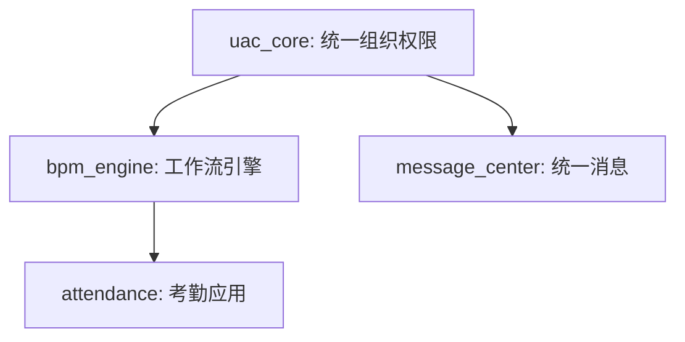

---
# ==========================================
# 📄 Document Metadata (由 Agent 自动维护，防篡改)
# ==========================================
doc_type: "GLOBAL_BLUEPRINT"           # 文档类型
module_id: "global_blueprint"          # 唯一模块标识符
version: "V 1.0"                       # 版本号
phase: "Phase_1_Strategic"             # 当前所处生命周期阶段
status: "Draft"                        # 状态机 (Draft -> Reviewing -> Approved)
complexity: "L1"                       # 复杂度评级

# ==========================================
# 🤖 Agentic Workflow & Audit (流转与审计追溯)
# ==========================================
author_agent: "{pm_agent}"
reviewer_agent: "{coordinator_agent}"
last_updated: "YYYY-MM-DDTHH:mm:ssZ"
approved_by: ""                        # [人工断点] 签名，无此签名 Coordinator 拒绝放行

# ==========================================
# 🔗 Dependency & Isolation (DAG 依赖与架构隔离)
# ==========================================
depends_on: []
acl_dependencies: []
---

# 全局架构蓝图与拆解计划 (Global Blueprint)

## 1. 业务域边界划分 (Domain Boundaries)

*明确本产品拆分为哪几个核心大模块，以及它们之间的边界。*

| 模块 ID (`module_id`) | 模块名称 | 核心职责与边界说明 |
| :--- | :--- | :--- |
| `uac_core` | 统一组织与权限中心 | 负责人员、组织树、角色和权限校验，不涉及具体业务流转。 |
| `bpm_engine` | 核心工作流引擎 | 负责表单渲染和节点审批流转，依赖 `uac_core` 获取汇报线。 |

## 2. 粒度拆解与复杂度评估 (Complexity Matrix)

*针对上述划分的模块，给出 AI 的复杂度评估与拆解粒度建议。*

| 模块 ID | 并发要求 | 数据隔离 | 主数据风险 | 建议粒度 (L1-L4) | 拆解理由 |
| :--- | :--- | :--- | :--- | :--- | :--- |
| `uac_core` | 高并发 | 物理隔离 | 高 | **L4 (详细)** | 属于底层基座，任何缺陷都会引起全局故障，需拆解到最细。 |
| `bpm_engine` | 需锁机制 | 逻辑隔离 | 中 | **L3 (功能级)** | 逻辑复杂，但可通过标准设计模式控制风险。 |

## 3. 核心领域实体提取 (Core Entities)

*在编写具体 PRD 之前，提前定义顶级的领域模型，确保各子 Agent 命名一致。*

* **User (用户)**: 系统的自然人实体。
* **Tenant (租户)**: 数据隔离的最高层级。
* **Role (角色)**: 权限的集合。

## 4. 基于 DAG 的生成顺序规划 (Execution Flow)

*规划各模块 PRD 的生成顺序。下游 PRD 生成时，必须挂载上游已生成的 PRD 作为只读上下文。*
*(注：当前工作流引擎按拓扑排序进行**串行唤醒**，未来可支持无依赖节点**并行执行**。)*

### 节点执行批次
* **Phase 0 (基础设施)**: `uac_core`
* **Phase 1 (中台服务)**: `bpm_engine`, `message_center` (待 `uac_core` Approved 后执行)
* **Phase 2 (上层应用)**: `attendance` (待 `bpm_engine` Approved 后执行)

---
*(AI 提示：生成完此蓝图后，请立即挂起并呼叫人类{修订人}进行审批。)*
