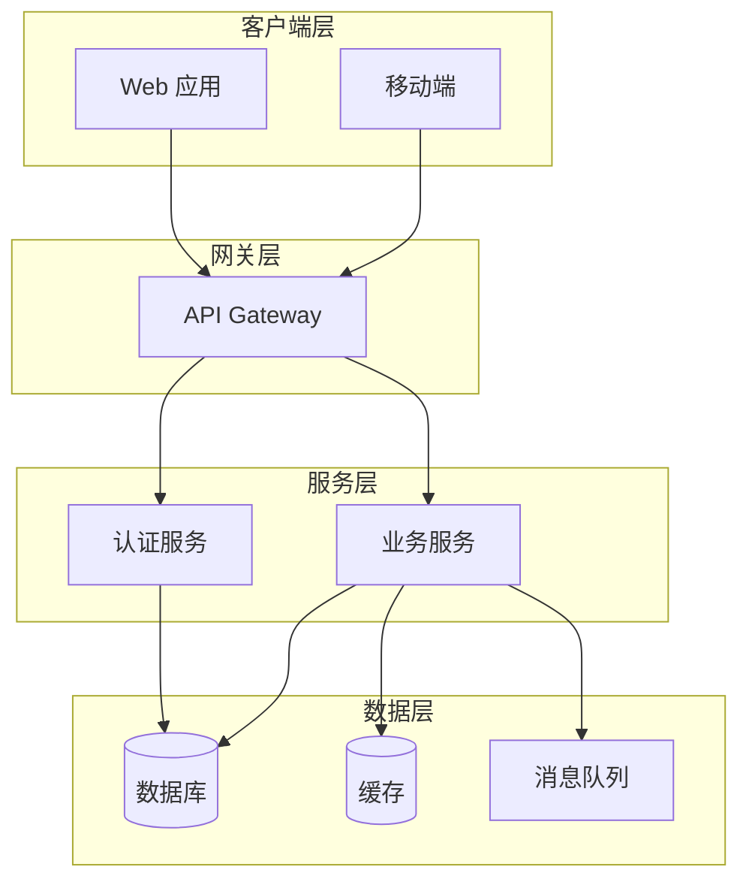
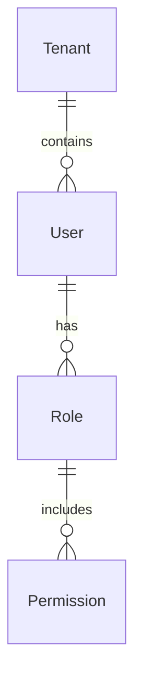

---
# ==========================================
# 📄 Document Metadata (由 Agent 自动维护)
# ==========================================
doc_type: "GLOBAL_HLD"
module_id: "global_hld"
version: "V 1.0"
phase: "Phase_3_Architecture"
status: "Draft"
complexity: "L1"

# ==========================================
# 🤖 Agentic Workflow & Audit
# ==========================================
author_agent: "{architect}"
reviewer_agent: "{coordinator_agent}"
last_updated: "YYYY-MM-DDTHH:mm:ssZ"
approved_by: ""

# ==========================================
# 🔗 Dependency & Isolation
# ==========================================
depends_on:
  - "GLOBAL_BLUEPRINT"
  - "MASTER_PRD"
acl_dependencies: []
---

# 全局高层设计 (Global High-Level Design)

> **用途**: 定义系统的总体架构、技术选型、模块划分及数据流，作为各模块详细设计的顶层指导。

## 1. 系统架构概览

### 1.1 架构风格

> 描述系统采用的架构风格（如：微服务、单体、Serverless 等）

### 1.2 架构图

---

## 2. 技术选型

### 2.1 前端技术栈

| 层级 | 技术选型 | 版本 | 选型理由 |
|------|----------|------|----------|
| 框架 | React / Vue | x.x | |
| 状态管理 | Redux / Pinia | x.x | |
| 构建工具 | Vite | x.x | |

### 2.2 后端技术栈

| 层级 | 技术选型 | 版本 | 选型理由 |
|------|----------|------|----------|
| 语言 | TypeScript / Python / Go | x.x | |
| 框架 | {Web框架A} / {Web框架B} / {Web框架C} | x.x | |
| ORM | {ORM_A} / {ORM_B} / {ORM_C} | x.x | |

### 2.3 基础设施

| 组件 | 技术选型 | 版本 |
|------|----------|------|
| 数据库 | PostgreSQL / MySQL | x.x |
| 缓存 | Redis | x.x |
| 消息队列 | RabbitMQ / Kafka | x.x |
| 容器化 | Docker + Kubernetes | x.x |

---

## 3. 模块划分

### 3.1 模块清单

| 模块 ID | 模块名称 | 职责边界 | 依赖模块 |
|---------|----------|----------|----------|
| `uac` | 用户与权限 | 用户、组织、角色、权限管理 | - |
| `core` | 核心业务 | (待填充) | `uac` |

### 3.2 模块通信

> 描述模块间的通信方式（同步/异步、协议等）

---

## 4. 数据架构

### 4.1 数据库设计原则

- 所有表必须有 `tenant_id`（多租户隔离）
- 所有表必须有 `created_at`, `updated_at`
- 禁止物理删除，使用 `is_deleted` 或 `deleted_at`

### 4.2 核心实体关系

---

## 5. 安全架构

### 5.1 认证授权

- 认证方式：JWT + OAuth2
- Token 有效期：Access Token 1h, Refresh Token 7d

### 5.2 数据安全

- 敏感数据加密存储
- API 请求 HTTPS 强制
- 日志脱敏

---

## 6. 部署架构

### 6.1 环境划分

| 环境 | 用途 | 域名 |
|------|------|------|
| dev | 开发环境 | dev.example.com |
| staging | 预发环境 | staging.example.com |
| prod | 生产环境 | api.example.com |

---

## 7. 多租户架构

### 7.1 tenant_id 传播链

> 描述 tenant_id 从请求入口到数据库的完整传播路径（Middleware → Context → Repository → RLS）。

### 7.2 RLS 策略

> 描述 PostgreSQL Row-Level Security 策略的创建、绑定与切换机制。

### 7.3 全局表豁免清单

> 列出不含 tenant_id 的全局表及其豁免理由。

---

## 8. 事件驱动架构

### 8.1 Event Bus

> 描述事件总线的实现（Redis Streams / Kafka）、分区策略与消费语义。

### 8.2 中间件链

> 描述事件发布/订阅的中间件链（幂等检查→Schema校验→持久化→发布）。

### 8.3 Subscriber 注册

> 描述订阅者的注册、路由与错误处理机制。

### 8.4 Saga / 编排

> 描述跨模块长事务的编排策略（Choreography vs Orchestration）与补偿机制。

---

## 9. AOP 横切概览

### 9.1 四层拦截架构

> 总图：Transport → Application → Domain → Infrastructure 四层 AOP 拦截点及其职责。
> 详细设计引用 `AOP_DESIGN.md`。

---

## 10. 集成架构

### 10.1 {平台模块8} 连接器

> 描述外部系统集成的连接器框架（凭证管理、速率限制、重试策略）。

### 10.2 外部 API 调用链路

> 描述外部 API 调用的完整链路（请求构建→认证→调用→响应处理→错误回退）。

---

## 11. NFR 目标概览

### 11.1 性能指标

> 引用 `NFR_REGISTRY.md` 中的性能目标（延迟、吞吐量、并发）。

### 11.2 可靠性指标

> 引用 `NFR_REGISTRY.md` 中的可靠性目标（可用性、RPO、RTO）。

### 11.3 安全指标

> 引用 `NFR_REGISTRY.md` 中的安全目标与审计要求。

---

## 12. 变更日志

| 版本 | 日期 | 变更内容 | 作者 |
|------|------|----------|------|
| v1.0.0 | YYYY-MM-DD | 初始版本 | {architect} |
