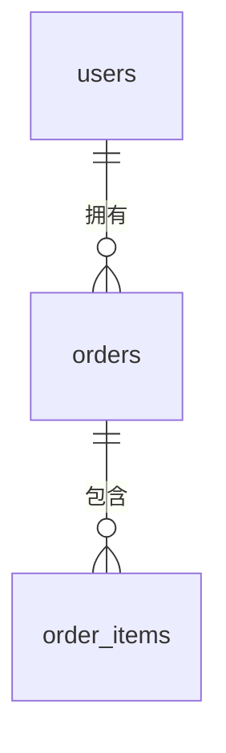

# LLD 示例 (LLD Example)

> **说明**: 本文档为 Sub LLD 模板的简化示例，展示如何填写 LLD。
> **模板**: 参见 `docs/08_templates/Sub_LLD_Template.md`

---

## §1. 模块概述与边界

### 1.1 模块定位

{模块一句话定位}

### 1.2 核心职责

| # | 职责 | 说明 | 优先级 |
|---|------|------|--------|
| 1 | {职责1} | {说明} | P0 |
| 2 | {职责2} | {说明} | P1 |

### 1.3 边界定义

**包含**:
- {能力1}
- {能力2}

**不包含**:
- {能力3}（属于 {其他模块}）

### 1.4 上下游依赖

| 方向 | 模块 | 交互方式 | 说明 |
|------|------|---------|------|
| 上游 | {模块A} | 同步调用 | {说明} |
| 下游 | {模块B} | Event Bus | {说明} |

### 1.5 需求溯源区 [强制]

| 原子需求 ID | 语义要素 | 来源（原文） | 推导链 |
|------------|---------|-------------|--------|
| @req-id: R001 | {要素} | PRD §3.1 | {推理过程} |
| @req-id: R002 | {要素} | PRD §3.2 | {推理过程} |

## §2. 数据库设计

### 2.1 ER 图

### 2.2 表结构

#### users（用户表）

| 字段名 | 类型 | 约束 | 说明 |
|--------|------|------|------|
| `id` | UUID | PK | 主键 |
| `tenant_id` | UUID | NOT NULL | 租户 ID |
| `email` | VARCHAR(255) | UNIQUE | 邮箱 |
| `name` | VARCHAR(100) | NOT NULL | 姓名 |
| `created_at` | TIMESTAMPTZ | NOT NULL | 创建时间 |
| `updated_at` | TIMESTAMPTZ | NOT NULL | 更新时间 |
| `deleted_at` | TIMESTAMPTZ | NULL | 软删除 |

## §3. API 设计

### 3.1 端点清单

| # | Method | Path | 说明 | 权限 |
|---|--------|------|------|------|
| 1 | GET | `/api/v1/users` | 用户列表 | user:read |
| 2 | POST | `/api/v1/users` | 创建用户 | user:write |
| 3 | GET | `/api/v1/users/:id` | 用户详情 | user:read |
| 4 | PUT | `/api/v1/users/:id` | 更新用户 | user:write |
| 5 | DELETE | `/api/v1/users/:id` | 删除用户 | user:delete |
