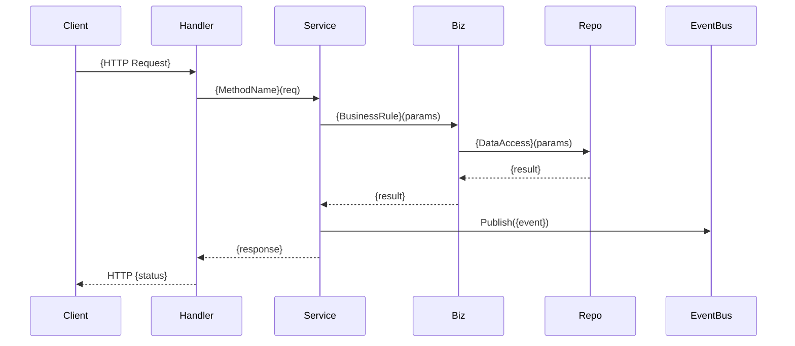

# {MODULE_NAME} Sub LLD

> **模块 ID**: {MODULE_ID}
> **DAG Phase**: {dag_phase}
> **复杂度**: {complexity}
> **关联 PRD**: `docs/02_backend/prd/{saas|paas|data}/{MODULE_ID}_*.md`
> **关联 MASTER LLD**: `docs/02_backend/lld/MASTER_LLD.md`

---

## §1. 模块概述与边界 [Core]

> **SSOT**: `docs/02_backend/architecture/{saas|paas}/{MODULE_ID}_*.md` + `docs/02_backend/prd/{saas|paas|data}/{MODULE_ID}_*.md` + `docs/00_meta/global-blueprint.md`
> **骨架填充** (Gate 7b): 模块一句话定位、核心职责列表、上下游模块 ID、对外暴露的能力清单
> **血肉填充** (Gate 7c): 详细业务规则、边界判断条件、与其他模块的交互协议细节、非功能约束

### 1.1 模块定位

{一句话描述本模块在 {产品名称} 平台中的角色和核心价值}

### 1.2 核心职责

| # | 职责 | 说明 | 优先级 |
|---|------|------|--------|
| 1 | {职责名称} | {简述} | P0/P1/P2 |
| 2 | ... | ... | ... |

### 1.3 边界定义

**包含（In Scope）**:
- {本模块负责的能力 1}
- {本模块负责的能力 2}

**不包含（Out of Scope）**:
- {明确排除的能力 1, 属于 {MODULE_ID_XX} 模块}
- {明确排除的能力 2}

### 1.4 上下游依赖

| 方向 | 模块 ID | 交互方式 | 说明 |
|------|---------|---------|------|
| 上游 | {MODULE_ID} | 同步调用 / Event Bus / 共享表 | {依赖原因} |
| 下游 | {MODULE_ID} | Event Bus / 回调 / 无 | {被依赖原因} |

### 1.5 目录结构

```
src/{layer}/{module}/
├── handler         # HTTP 处理器（参数校验、响应包装）
├── service         # 编排层（事务边界）
├── biz             # 核心业务规则（纯逻辑、可单测）
├── repo            # 数据访问层
├── model           # 数据模型 + DTO
├── event           # 事件定义（EventBus publish/subscribe）
├── acl             # 防腐层适配器
├── errors          # 模块错误码
└── task/           # 定时任务（如适用）
    └── {task_name}
```

### 1.6 需求溯源区 [强制]

> **说明**：本章节为需求溯源区，直接锚定上游原文（PRD/Sub-PRD），实现跳跃连接。
> 溯源区内容由人工或工具填充，LLM 不得修改。
> 详见 `docs/08_templates/traceability-zone.md`。

#### 原子需求承接

| 原子需求 ID | 语义要素 | 来源（原文） | 推导链 |
|------------|---------|-------------|--------|
| @req-id: R001 | {要素描述} | {PRD/Sub-PRD 原文} | {设计决策推理过程} |
| @req-id: R002 | {要素描述} | {PRD/Sub-PRD 原文} | {设计决策推理过程} |

#### 推导链模板

##### 推导链 1：@req-id: R001

**需求**：{PRD/Sub-PRD 原文}

**约束**：
- {约束 1}
- {约束 2}

**方案**：
- {方案描述}

**理由**：
- {为什么选择这个方案}
- {与其他方案的对比}

**结论**：
- {最终设计决策}

#### 术语约束

| 术语/字段名 | 定义来源 | 约束 |
|------------|---------|------|
| {术语1} | glossary.md | {约束说明} |
| {字段名1} | metadata-dictionary.md | {约束说明} |

#### 索引标注

> 本文档承接的需求 ID 汇总：

| 需求 ID | 来源 | 状态 |
|---------|------|------|
| @req-id: R001 | PRD §1.2 | ✅ 已承接 |
| @req-id: R002 | PRD §2.1 | ✅ 已承接 |

---

## §2. 数据库设计 [Core]

> **SSOT**: `docs/02_backend/data-model/tables/{MODULE_ID}_*.json` + `docs/02_backend/data-model/enums/{MODULE_ID}_*.json` + `docs/02_backend/specs/NFR_REGISTRY.md`
> **骨架填充** (Gate 7b): 所有表名、字段名、类型、约束、索引列表（从 ER JSON 提取）
> **血肉填充** (Gate 7c): 完整 DDL（含 RLS policy）、分区策略、数据量估算、归档策略

### 2.1 ER 图

```mermaid
erDiagram
    {TABLE_A} ||--o{ {TABLE_B} : "{关系描述}"
    {TABLE_B} }o--|| {TABLE_C} : "{关系描述}"
```

### 2.2 表结构

#### {table_name}（{表用途}）

| 字段名 | 类型 | 约束 | 说明 |
|--------|------|------|------|
| `id` | UUID | PK, DEFAULT gen_random_uuid() | 主键 |
| `tenant_id` | UUID | NOT NULL, FK → tenants.id | 租户 ID（RLS） |
| {field_name} | {type} | {constraint} | {description} |
| `created_at` | TIMESTAMPTZ | NOT NULL, DEFAULT NOW() | 创建时间 |
| `updated_at` | TIMESTAMPTZ | NOT NULL, DEFAULT NOW() | 更新时间 |
| `deleted_at` | TIMESTAMPTZ | NULL | 软删除标记 |

```sql
CREATE TABLE {table_name} (
    id UUID PRIMARY KEY DEFAULT gen_random_uuid(),
    tenant_id UUID NOT NULL,
    -- {字段定义}
    created_at TIMESTAMPTZ NOT NULL DEFAULT NOW(),
    updated_at TIMESTAMPTZ NOT NULL DEFAULT NOW(),
    deleted_at TIMESTAMPTZ
);

-- RLS 策略
ALTER TABLE {table_name} ENABLE ROW LEVEL SECURITY;
CREATE POLICY {table_name}_tenant_isolation ON {table_name}
    USING (tenant_id = current_setting('app.tenant_id')::uuid);
```

### 2.3 索引策略

| 表 | 索引名 | 字段 | 类型 | 说明 |
|----|--------|------|------|------|
| {table} | idx_{table}_{field} | {field} | B-tree / GIN / Partial | {查询场景} |

### 2.4 数据量与分区

| 表 | 预估日增量 | 预估总量(1年) | 分区策略 | 归档策略 |
|----|-----------|-------------|---------|---------|
| {table} | {N rows/day} | {N rows} | {按月/按租户/无} | {N 天后归档/不归档} |

---

## §3. API 设计 [Core]

> **SSOT**: `docs/03_api/contracts/{MODULE_ID}_*.json` + `docs/02_backend/specs/DEV_STANDARDS.md`
> **骨架填充** (Gate 7b): 端点列表（Method + Path + 简述）、请求/响应 DTO 骨架
> **血肉填充** (Gate 7c): 完整请求参数校验规则、响应字段映射、分页/排序/过滤规范、错误响应格式

### 3.1 端点清单

| # | Method | Path | 说明 | 权限 | 复杂度 |
|---|--------|------|------|------|--------|
| 1 | GET | `/api/v1/{resource}` | {列表查询} | {permission}:read | L1 |
| 2 | POST | `/api/v1/{resource}` | {创建} | {permission}:write | L2 |
| 3 | GET | `/api/v1/{resource}/:id` | {详情} | {permission}:read | L1 |
| 4 | PUT | `/api/v1/{resource}/:id` | {更新} | {permission}:write | L2 |
| 5 | DELETE | `/api/v1/{resource}/:id` | {删除} | {permission}:delete | L1 |

### 3.2 请求/响应示例

#### POST /api/v1/{resource}

**Request**:
```json
{
  "field_a": "{value}",
  "field_b": 0
}
```

**Response** (200):
```json
{
  "code": 0,
  "message": "success",
  "data": {
    "id": "{uuid}",
    "field_a": "{value}",
    "field_b": 0,
    "created_at": "YYYY-MM-DDTHH:mm:ssZ"
  }
}
```

### 3.3 分页与过滤规范

- 分页参数: `page` (默认 1), `page_size` (默认 20, 上限 100)
- 排序参数: `sort_by` + `sort_order` (asc/desc)
- 过滤参数: 按 API contract 定义, 使用 query string

---

## §4. 状态机设计 [Conditional: 本模块包含状态驱动的实体]

> **SSOT**: `docs/02_backend/data-model/state-machines/{MODULE_ID}_fsm.json`
> **骨架填充** (Gate 7b): 状态枚举、转换列表（from → to → action）、守卫条件名称
> **血肉填充** (Gate 7c): 每个转换的守卫条件实现逻辑、副作用（事件发布/通知）、回滚策略

> ⚠️ 若本模块不涉及状态机，填写 `N/A — 本模块无状态驱动的实体` 后跳过。

### 4.1 状态转换图

```mermaid
stateDiagram-v2
    [*] --> {InitialState}
    {State_A} --> {State_B} : {Action_X}
    {State_B} --> {State_C} : {Action_Y}
    {State_C} --> [*]
```

### 4.2 状态枚举

| 状态 | 值 | 说明 | 终态? |
|------|-----|------|-------|
| {state_name} | {value} | {description} | Yes/No |

### 4.3 转换规则

| # | From | Action | To | 守卫条件 | 副作用 |
|---|------|--------|----|---------|--------|
| 1 | {State_A} | {Action_X} | {State_B} | {条件描述} | {发布事件/通知} |

### 4.4 回滚策略

{描述非法状态转换的恢复策略，或不可逆操作的补偿机制}

---

## §5. 跨模块事件契约 [Conditional: 本模块发布或订阅 EventBus 事件]

> **SSOT**: `docs/02_backend/specs/GLOBAL_HLD.md` §事件驱动 + `docs/02_backend/architecture/{saas|paas}/*.md`
> **骨架填充** (Gate 7b): 事件名称列表、发布/订阅方向、Payload 骨架
> **血肉填充** (Gate 7c): 完整 Payload schema、幂等消费策略、失败重试策略、事件版本兼容方案

> ⚠️ 若本模块不参与跨模块事件，填写 `N/A — 本模块不发布/订阅 EventBus 事件` 后跳过。

### 5.1 事件清单

| # | 事件名 | 方向 | Topic | 触发时机 | 消费方 |
|---|--------|------|-------|---------|--------|
| 1 | `{module}.{entity}.{action}` | Publish | `{topic}` | {触发条件} | {MODULE_ID} |
| 2 | `{module}.{entity}.{action}` | Subscribe | `{topic}` | {来源模块触发} | 本模块 |

### 5.2 Payload 定义

```json
{
  "event_id": "{uuid}",
  "event_type": "{module}.{entity}.{action}",
  "tenant_id": "{uuid}",
  "timestamp": "YYYY-MM-DDTHH:mm:ssZ",
  "payload": {
    "entity_id": "{uuid}",
    "{field}": "{value}"
  }
}
```

### 5.3 消费策略

| 事件 | 幂等方式 | 重试次数 | 重试间隔 | 死信处理 |
|------|---------|---------|---------|---------|
| {event_name} | {entity_id + event_type 唯一} | {N} | {退避策略} | {告警 + 人工介入} |

---

## §6. Service 接口契约 [Core]

> **SSOT**: `docs/02_backend/specs/GLOBAL_HLD.md` §B3 Module 接口 + `docs/02_backend/specs/DEV_STANDARDS.md`
> **骨架填充** (Gate 7b): Module interface 方法签名、Handler/Service/Biz/Repo 层方法签名列表
> **血肉填充** (Gate 7c): 每个方法的完整入参/出参 struct、业务规则注释、事务边界标注

### 6.1 Module 接口

```go
type {ModuleName}Module struct{}

func (m *{ModuleName}Module) Name() string                                    { return "{module_id}" }
func (m *{ModuleName}Module) RegisterRoutes(r *gin.RouterGroup)              { /* ... */ }
func (m *{ModuleName}Module) RegisterEvents(bus *event.Bus)                  { /* ... */ }
func (m *{ModuleName}Module) RegisterMigrations(mg *migrate.Migrator)        { /* ... */ }
func (m *{ModuleName}Module) Init() error                                     { return nil }
```

### 6.2 Service 层接口

```go
type {ModuleName}Service interface {
    // {方法简述}
    {MethodName}(ctx context.Context, req *{ReqType}) (*{RespType}, error)
}
```

### 6.3 Biz 层接口

```go
type {ModuleName}Biz interface {
    // {纯业务规则方法}
    {MethodName}(ctx context.Context, {params}) ({returns}, error)
}
```

### 6.4 Repo 层接口

```go
type {ModuleName}Repo interface {
    // {数据访问方法}
    {MethodName}(ctx context.Context, {params}) ({returns}, error)
}
```

---

## §7. 核心逻辑设计 [Core]

> **SSOT**: `docs/02_backend/prd/{saas|paas|data}/{MODULE_ID}_*.md` + `docs/02_backend/specs/GLOBAL_HLD.md`
> **骨架填充** (Gate 7b): 核心用例列表、关键业务流程名称、涉及的方法签名
> **血肉填充** (Gate 7c): 每个用例的详细流程（含分支判断、异常处理）、时序图、关键伪代码

### 7.1 核心用例清单

| # | 用例名称 | 入口方法 | 涉及实体 | 复杂度 |
|---|---------|---------|---------|--------|
| 1 | {用例名称} | {Service.Method} | {EntityA}, {EntityB} | L1/L2/L3 |

### 7.2 核心流程时序图



### 7.3 关键业务规则

#### 规则 {N}: {规则名称}

- **触发条件**: {何时触发}
- **规则描述**: {详细规则内容}
- **异常处理**: {违规/异常时的行为}
- **相关代码**: `biz.go#MethodName()`

---

## §8. 防腐层设计（ACL） [Core]

> **SSOT**: `docs/02_backend/specs/GLOBAL_HLD.md` §依赖方向 + `docs/02_backend/architecture/{saas|paas}/*.md`
> **骨架填充** (Gate 7b): 外部依赖列表（模块/服务/中间件）、依赖方向是否合规
> **血肉填充** (Gate 7c): 每个外部依赖的 Port/Adapter 实现、接口隔离细节、降级策略

### 8.1 外部依赖清单

| # | 依赖 | 类型 | 方向 | 隔离方式 | 降级策略 |
|---|------|------|------|---------|---------|
| 1 | {MODULE_ID / Redis / MinIO / LLM} | 模块/中间件/外部服务 | {同步/异步} | Port + Adapter | {降级行为} |

### 8.2 Port 接口定义

```go
// Port 定义本模块对外部能力的抽象接口
type {DependencyName}Port interface {
    {MethodName}(ctx context.Context, {params}) ({returns}, error)
}
```

### 8.3 Adapter 实现

```go
// Adapter 实现具体的外部依赖适配
type {dependencyName}Adapter struct {
    // {client / repo 引用}
}

func (a *{dependencyName}Adapter) {MethodName}(ctx context.Context, {params}) ({returns}, error) {
    // {适配逻辑, 包含错误转换和数据映射}
}
```

---

## §9. 并发控制与幂等 [Conditional: 本模块存在并发写场景或需要幂等保证]

> **SSOT**: `docs/02_backend/specs/SECURITY_BASELINE.md` + `docs/02_backend/specs/GLOBAL_HLD.md`
> **骨架填充** (Gate 7b): 识别并发热点（竞态条件出现的操作）、需要幂等的接口列表
> **血肉填充** (Gate 7c): 每个热点的锁策略/乐观锁版本号/幂等 token 机制、死锁预防、分布式锁 Key 设计

> ⚠️ 若本模块无并发写场景，填写 `N/A — 本模块无并发热点` 后跳过。

### 9.1 并发热点分析

| # | 操作 | 并发场景 | 冲突类型 | 策略 |
|---|------|---------|---------|------|
| 1 | {操作名} | {多用户同时 X} | {丢失更新/唯一约束冲突} | {乐观锁/悲观锁/分布式锁} |

### 9.2 幂等设计

| 接口 | 幂等键 | 幂等实现 | 过期时间 |
|------|--------|---------|---------|
| POST /api/v1/{resource} | {idempotency_key 字段} | Redis SETNX | {TTL} |

### 9.3 分布式锁 Key 规范

```
makex:{module}:{entity}:{entity_id}:{operation}
```

示例: `makex:trx:order:uuid-xxx-xxx:submit`

---

## §10. 错误码设计 [Core]

> **SSOT**: `docs/02_backend/specs/DEV_STANDARDS.md` §错误处理 + `docs/02_backend/data-model/enums/Global_Common.json`
> **骨架填充** (Gate 7b): 错误码段分配（{MODULE_ERROR_RANGE}）、错误分类
> **血肉填充** (Gate 7c): 每个错误码的完整定义（code + message + httpStatus + 用户提示 + 处理建议）

### 10.1 错误码段

本模块错误码段: `{MODULE_ERROR_START}000 ~ {MODULE_ERROR_END}999`

### 10.2 错误码清单

| 错误码 | HTTP Status | 错误消息 | 用户提示 | 处理建议 |
|--------|------------|---------|---------|---------|
| {N}0001 | 400 | {module}.{entity}.{action}.invalid_param | 参数校验失败 | 检查请求参数 |
| {N}0002 | 404 | {module}.{entity}.not_found | 资源不存在 | 确认资源 ID |
| {N}0003 | 409 | {module}.{entity}.{action}.conflict | 操作冲突 | {重试/刷新} |
| {N}0004 | 500 | {module}.{entity}.{action}.internal | 服务内部错误 | 联系管理员 |

### 10.3 错误码 Go 定义

```go
var (
    Err{Entity}{Action} = define({N}0001, "{module}.{entity}.{action}.invalid_param")
)
```

---

## §11. 缓存设计 [Conditional: 本模块使用 Redis 缓存]

> **SSOT**: `docs/02_backend/specs/CACHE_STRATEGY.md` + `docs/02_backend/specs/NFR_REGISTRY.md`
> **骨架填充** (Gate 7b): 需要缓存的数据对象、缓存用途（热点/会话/结果）
> **血肉填充** (Gate 7c): Key 设计、TTL、失效触发点、穿透/雪崩/击穿防护、降级策略

> ⚠️ 若本模块不需要缓存，填写 `N/A — 本模块不使用 Redis 缓存` 后跳过。

### 11.1 缓存对象清单

| # | 缓存对象 | 用途 | 数据结构 | TTL | 预估大小 |
|---|---------|------|---------|-----|---------|
| 1 | {entity} detail | 热点读取 | Hash | {N}s | {N} KB |

### 11.2 Key 命名规范

```
makex:{module}:{entity}:{tenant_id}:{entity_id}
```

示例: `makex:trx:order:t001:uuid-xxx-xxx`

### 11.3 失效策略

| 触发点 | 失效方式 | 失效范围 | 说明 |
|--------|---------|---------|------|
| {Entity} 创建/更新/删除 | 主动删除 (DEL) | 单条 Key | {原因} |
| {Entity} 状态变更 | 主动删除 + 事件通知 | 单条 + 列表 | {原因} |

### 11.4 防护策略

| 风险 | 防护措施 |
|------|---------|
| 缓存穿透 | {布隆过滤器/空值缓存} |
| 缓存雪崩 | {TTL 随机偏移 ±10%} |
| 缓存击穿 | {互斥锁/永不过期+异步刷新} |

---

## §12. 安全设计 [Core]

> **SSOT**: `docs/02_backend/specs/SECURITY_BASELINE.md` + `docs/02_backend/specs/DATA_PERMISSION_MATRIX.md`
> **骨架填充** (Gate 7b): 权限点列表、敏感字段识别、租户隔离确认
> **血肉填充** (Gate 7c): 字段级脱敏规则、SQL 注入防护、越权校验实现、审计日志记录点

### 12.1 权限矩阵

| 角色 | {Entity} | 读 | 写 | 删 | 审批 | 特殊 |
|------|---------|:--:|:--:|:--:|:----:|------|
| {Role_A} | ✅ | ✅ | ✅ | ✅ | {说明} |
| {Role_B} | ✅ | ❌ | ❌ | ❌ | {说明} |

### 12.2 敏感字段

| 字段 | 脱敏规则 | 存储方式 | 返回时机 |
|------|---------|---------|---------|
| {field} | {前 N 后 M, 中间 *} | {明文/加密/哈希} | {仅详情接口/所有接口} |

### 12.3 租户隔离

- 所有表包含 `tenant_id` 字段
- PostgreSQL RLS policy 强制隔离
- 查询层通过 `context` 注入 `tenant_id`，禁止前端传入

### 12.4 安全基线自查

| # | 基线项 | 状态 | 说明 |
|---|--------|:----:|------|
| 1 | SQL 注入防护 | ⬜ | ORM 参数化查询 |
| 2 | 越权校验 | ⬜ | handler 层校验 tenant_id + 权限 |
| 3 | 软删除 | ⬜ | deleted_at 字段 |
| 4 | 审计日志 | ⬜ | AOP 切面自动记录 |
| 5 | 限流 | ⬜ | HTTP 中间件 |

---

## §13. 可观测性设计 [Core]

> **SSOT**: `docs/02_backend/specs/MONITORING_DASHBOARD.md` + `docs/02_backend/specs/NFR_REGISTRY.md`
> **骨架填充** (Gate 7b): 核心业务指标列表、日志埋点位置、告警项名称
> **血肉填充** (Gate 7c): 指标采集实现（Prometheus/日志）、TraceID 透传链路、告警阈值与通知方式

### 13.1 核心业务指标

| # | 指标名 | 类型 | 说明 | 采集方式 |
|---|--------|------|------|---------|
| 1 | {module}_{entity}_total | Counter | {实体总数} | DB 聚合/缓存 |
| 2 | {module}_{action}_duration_seconds | Histogram | {操作耗时} | HTTP MW |

### 13.2 日志埋点

| 层级 | 埋点位置 | 级别 | 关键字段 | 说明 |
|------|---------|------|---------|------|
| Handler | {Method} 入口/出口 | INFO | trace_id, tenant_id, user_id, {entity}_id | 请求日志 |
| Service | {Method} 业务分支 | INFO/WARN | trace_id, {entity}_id, decision | 决策日志 |
| Biz | {Rule} 执行 | DEBUG | trace_id, input, output | 规则日志 |
| Repo | DB 操作 | ERROR (仅失败) | trace_id, sql, error | 数据访问日志 |

### 13.3 告警规则

| # | 告警名 | 条件 | 级别 | 通知方式 |
|---|--------|------|------|---------|
| 1 | {ModuleName}{Action}ErrorRate | 错误率 > {N}% 持续 {M}min | P0/P1 | {{通知渠道}} |

### 13.4 TraceID 透传

```
HTTP Middleware → context → Service → Biz → Repo → EventBus
                                            ↓
                                        外部服务调用
```

---

## §14. 备选方案与架构决策 [Conditional: 存在重要技术选型或架构决策]

> **SSOT**: 本模块设计过程中的决策记录
> **骨架填充** (Gate 7b): 列出需要决策的问题、已选方案
> **血肉填充** (Gate 7c): 每个决策的背景、备选方案对比、选择理由、权衡说明

> ⚠️ 若本模块无特殊架构决策，填写 `N/A — 本模块沿用全局技术选型，无特殊决策` 后跳过。

### 14.1 决策记录

| # | 决策问题 | 已选方案 | 备选方案 | 选择理由 | 权衡 |
|---|---------|---------|---------|---------|------|
| 1 | {问题} | {方案 A} | {方案 B, 方案 C} | {理由} | {牺牲了什么} |

### 14.2 决策详情

#### ADR-{N}: {决策标题}

- **背景**: {为什么需要做这个决策}
- **方案 A（已选）**: {描述}
- **方案 B**: {描述}
- **选择理由**: {为什么选 A}
- **影响**: {对性能/可维护性/成本的影响}

---

## §15. 风险与开放问题 [Core]

> **SSOT**: 本模块设计过程中发现的风险和待确认问题
> **骨架填充** (Gate 7b): 已知风险列表、开放问题列表（含来源）
> **血肉填充** (Gate 7c): 每个风险的缓解措施、开放问题的建议答案、决策截止时间

### 15.1 风险登记

| # | 风险 | 概率 | 影响 | 缓解措施 | 负责人 |
|---|------|:----:|:----:|---------|--------|
| 1 | {风险描述} | 高/中/低 | 高/中/低 | {缓解方案} | {MODULE_ID} Owner |

### 15.2 开放问题

| # | 问题 | 来源 | 状态 | 建议答案 | 决策截止 |
|---|------|------|:----:|---------|---------|
| 1 | {问题} | {PRD/架构/技术} | ⬜ Open / ✅ Closed | {建议} | {日期} |

---

## §16. 迁移方案 [Conditional: 本模块涉及数据迁移或从旧系统迁移]

> **SSOT**: `docs/02_backend/specs/GLOBAL_HLD.md` + `docs/02_backend/lld/MASTER_LLD.md` §Schema Freeze
> **骨架填充** (Gate 7b): 迁移范围、数据源、目标表
> **血肉填充** (Gate 7c): Flyway 脚本（UP + DOWN）、数据转换规则、回滚验证步骤、数据校验 SQL

> ⚠️ 若本模块不涉及数据迁移，填写 `N/A — 本模块无数据迁移需求` 后跳过。

### 16.1 迁移范围

| # | 源表/数据源 | 目标表 | 数据量 | 映射规则 |
|---|-----------|--------|--------|---------|
| 1 | {source} | {target} | {N rows} | {字段映射说明} |

### 16.2 Flyway 脚本

```
db/migration/
├── V{N}__{module}_{entity}_create_table.up.sql
├── V{N}__{module}_{entity}_create_table.down.sql
├── V{N+1}__{module}_{entity}_seed_data.up.sql
└── V{N+1}__{module}_{entity}_seed_data.down.sql
```

### 16.3 迁移验证

| 步骤 | 验证内容 | 通过标准 |
|------|---------|---------|
| UP | 表创建 + 数据写入 | 无错误, 行数一致 |
| DOWN | 回滚 | 表删除, 无残留 |
| UP (二次) | 幂等验证 | 与首次结果一致 |

---

## §17. 验收与测试计划 [Core]

> **SSOT**: `docs/02_backend/specs/NFR_REGISTRY.md` + `docs/02_backend/specs/DEV_STANDARDS.md` §测试
> **骨架填充** (Gate 7b): 验收标准列表（从 frontmatter acceptance_criteria 展开）、测试层级
> **血肉填充** (Gate 7c): 每条 AC 的测试用例、集成测试场景、性能基准、上线 Checklist

### 17.1 验收标准

| # | AC | 验证方式 | 优先级 |
|---|-----|---------|--------|
| 1 | {验收条件描述} | {单测/集成测试/手工} | P0/P1 |
| 2 | {所有 API P99 < Nms} | 压测 | P0 |
| 3 | {租户隔离验证} | 集成测试 | P0 |

### 17.2 测试层级

| 层级 | 覆盖范围 | 工具 | 目标覆盖率 |
|------|---------|------|-----------|
| 单元测试 | Biz 层纯逻辑 | Go testing | > 80% |
| 集成测试 | Service + Repo + DB | Go testing + Testcontainers | 核心用例 100% |
| API 测试 | Handler 端到端 | httptest | 所有端点 |
| 性能测试 | P99 延迟 / 吞吐 | {wrk/vegeta} | NFR 达标 |

### 17.3 关键测试用例

| # | 用例名 | 前置条件 | 操作 | 期望结果 |
|---|--------|---------|------|---------|
| 1 | {用例名} | {数据准备} | {操作步骤} | {期望结果} |

### 17.4 上线 Checklist

- [ ] 所有 P0 AC 验证通过
- [ ] 单测覆盖率达标
- [ ] 集成测试全绿
- [ ] 性能测试达标（NFR Registry 基线）
- [ ] 安全基线自查通过
- [ ] Flyway UP/DOWN/UP 验证通过
- [ ] 日志/告警配置就绪
- [ ] API 文档同步更新

---

## 变更日志

| 版本 | 日期 | 变更内容 | 作者 |
|------|------|---------|------|
| V2.0 | {YYYY-MM-DD} | 初始模板创建（17 章节结构） | {author_agent} |
| | | | |
